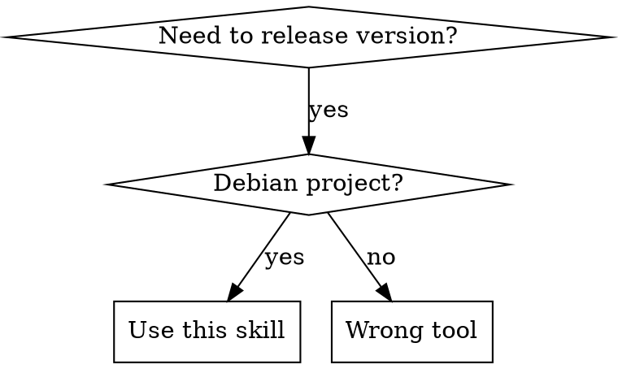

# create-release-tags

## Overview

Automates Debian package version releases by updating `debian/changelog` and `linglong.yaml` (if present), generating change summaries from git log, and creating version commits.

## When to Use



**Use when:**
- Releasing new version for Debian-based projects
- Preparing test releases (tag prepare-test)
- Bumping version numbers with changelog updates
- Projects with or without linglong.yaml

**Trigger phrases:**
- "tag release <version>"
- "tag release" (auto-increment)
- "tag prepare-test <version>"
- "release new version"
- "bump version"
- "update version"
- "prepare for release"
- "prepare for testing"

**Do NOT use when:**
- Projects without debian/changelog
- Creating git tags (this skill only commits changes)
- Non-Debian projects

## Quick Reference

| Operation | Command | Behavior |
|-----------|---------|----------|
| Release specific version | `tag release 1.2.3` | Updates to specified version |
| Auto-increment patch | `tag release` | Increments patch (1.2.2 → 1.2.3) |
| Prepare test version | `tag prepare-test 1.2.3` | Updates for testing phase |

## Implementation

### Step 1: Detect Project Type

```bash
# Check required files
if [ ! -f debian/changelog ]; then
    echo "Error: Not a Debian project (debian/changelog not found)"
    exit 1
fi

# Check for linglong.yaml files
LINGLONG_FILES=$(find . -name "linglong.yaml" -type f)
HAS_LINGLONG=1
if [ -z "$LINGLONG_FILES" ]; then
    HAS_LINGLONG=0
fi
```

### Step 2: Determine Target Version

**Default behavior**: If no version specified, auto-increment patch version (e.g., 6.5.26 → 6.5.27)

**If version specified:**
```bash
TARGET_VERSION="$1"  # e.g., 6.5.47
```

**If auto-increment (no version specified):**
```bash
# Extract current version from changelog
CURRENT_VERSION=$(head -1 debian/changelog | sed -n 's/.*(\(.*\)).*/\1/p')
# Extract and increment patch version (only increments patch: X.Y.Z → X.Y.Z+1)
MAJOR=$(echo $CURRENT_VERSION | cut -d. -f1)
MINOR=$(echo $CURRENT_VERSION | cut -d. -f2)
PATCH=$(echo $CURRENT_VERSION | cut -d. -f3)
TARGET_VERSION="${MAJOR}.${MINOR}.$((PATCH + 1))"
```

### Step 3: Generate Change Summary

**IMPORTANT**: Get commits from current changelog version (NOT from git tags, as tags may not always be created).

```bash
# Extract date from first author line in changelog
# Format: "Mon, 05 Jan 2026 15:29:58 +0800"
# This finds the line starting with " -- " and extracts the date part
CURRENT_DATE=$(grep -m1 "^ -- " debian/changelog | sed 's/.*  //')

# Get commit titles since that date (note: two spaces before *)
if [ -n "$CURRENT_DATE" ]; then
    CHANGES=$(git log --since="${CURRENT_DATE}" --pretty=format:"  * %s")
else
    # Fallback: get recent commits if date extraction fails
    CHANGES=$(git log --pretty=format:"  * %s" -10)
fi

# If no changes, use generic message
if [ -z "$CHANGES" ]; then
    CHANGES="  * chore: bump version to ${TARGET_VERSION}"
fi
```

### Step 4: Get Author Information

```bash
AUTHOR_NAME=$(git config user.name)
AUTHOR_EMAIL=$(git config user.email)

if [ -z "$AUTHOR_EMAIL" ]; then
    echo "Error: Git user.email not configured"
    echo "Please run: git config user.email 'your@email.com'"
    exit 1
fi

DATE_R=$(date -R)
```

### Step 5: Get Package Name

```bash
PACKAGE_NAME=$(head -1 debian/changelog | sed -n 's/\([^ ]*\) .*/\1/p')
```

### Step 6: Update debian/changelog

Create new entry at top of file:

```text
${PACKAGE_NAME} (${TARGET_VERSION}) unstable; urgency=medium

${CHANGES}

 -- ${AUTHOR_NAME} <${AUTHOR_EMAIL}>  ${DATE_R}

<existing entries follow>
```

Example:
```text
deepin-reader (6.5.47) unstable; urgency=medium

  * fix: correct .tx/config
  * chore: enhance service security
  * feat: add new feature

 -- Author Name <email@example.com>  Mon, 05 Jan 2026 15:29:58 +0800

deepin-reader (6.5.46) unstable; urgency=medium
...
```

**Implementation:**
```bash
# Read existing changelog
EXISTING=$(cat debian/changelog)

# Create new entry (note: two spaces before each * and author line)
NEW_ENTRY="${PACKAGE_NAME} (${TARGET_VERSION}) unstable; urgency=medium

${CHANGES}

 -- ${AUTHOR_NAME} <${AUTHOR_EMAIL}>  ${DATE_R}

"

# Write new content
echo "${NEW_ENTRY}${EXISTING}" > debian/changelog
```

**Important formatting notes:**
- Each change line starts with **two spaces** + `*`: `  * fix: something`
- Author line starts with **two spaces** + `--`: ` -- Author <email>`
- Double newline between version entries

### Step 7: Update linglong.yaml (if exists)

For each linglong.yaml file:
- Update version field: `X.Y.Z.N` → `X.Y.Z.N` (update only first three parts)
- Keep last number unchanged

Example: `version: 6.5.46.1` → `version: 6.5.47.1`

**Implementation:**
```bash
if [ $HAS_LINGLONG -eq 1 ]; then
    TARGET_VERSION_NO_PATCH=$(echo $TARGET_VERSION | cut -d. -f1-3)
    find . -name "linglong.yaml" -type f -exec sed -i "s/version: [0-9]\+\.[0-9]\+\.[0-9]\+\.[0-9]\+/version: ${TARGET_VERSION_NO_PATCH}.1/g" {} \;
fi
```

### Step 8: Commit Changes

```bash
git add debian/changelog
if [ $HAS_LINGLONG -eq 1 ]; then
    git add $(find . -name "linglong.yaml" -type f)
fi

git commit -m "chore: update version to ${TARGET_VERSION}

- bump version to ${TARGET_VERSION}

Log : bump version to ${TARGET_VERSION}"
```

**Commit message format:**
- Line 1: `chore: update version to <version>` (lowercase)
- Empty line
- Bullet: `- bump version to <version>` (lowercase)
- Log prefix: `Log : bump version to <version>` (note space after colon)

## Common Mistakes

| Mistake | Why It's Wrong | Fix |
|---------|----------------|-----|
| Creating git tags | This skill only commits, does not tag | Use separate command for git tag creation |
| Using git tags for change summary | Git tags may not exist for all releases | Use changelog date instead |
| Updating all parts of linglong version | Only first three parts should change | Use `X.Y.Z.1` pattern, not full version |
| Missing git user.email | Author information required for changelog | Configure `git config user.email` |
| Using "Release" in commit | Wrong commit message format | Use "chore: update version to X.Y.Z" |
| Forgetting to add linglong files | linglong.yaml changes need to be committed | Use `find` to locate and add all linglong.yaml files |

## Red Flags - STOP and Check

- Commit message doesn't follow exact format
- Using git tags instead of changelog for change summary
- linglong.yaml version changes all four parts
- Missing git user.email configuration
- debian/changelog doesn't exist
- Trying to create git tags (not supported)

**If any red flag appears, STOP and review the implementation section above.**
